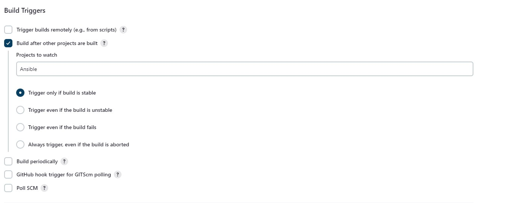

# ANSIBLE-REFACTORING-AND-STATIC-ASSIGNMENTS-IMPORTS-AND-ROLES-t

**The Objective of the Project**


*The objective of this project is to improve the Ansible code by refactoring it and creating assignments, and to learn how to use the imports functionality to effectively re-use previously created playbooks in a new playbook. Refactoring involves making changes to the source code to enhance its readability, maintainability, extensibility, and reduce complexity without changing the expected behavior of the software. The main goal is to organize tasks and reuse them when needed while keeping the infrastructure state the same.*


**Architecture of the solution**


**Step 1: Enhancement of the Jenkins job**

This is a continuation of [workplace-11](https://github.com/olaniyi2oguns/Workplace-11.git). So, before we continue, we need to make some changes to the jenkins job because every new change in the codes creates a separate directory which is not very convenient when we want to run some commands from one place. Also, it occupies more space on the jenkins server with each subsequent change. So there is a need to enhance by creating a new job called "save_artifact". To achieve this we will need to install a "copy Artifact" plugin.

Login into your Jenkins server and click on "manage jenkins" and click on plugins. Click on available and search for "copy Artifact" and install it. 


On your terminal, bring up your jenkins server, create a new direcotory and name it "ansible-config-artifact"

`sudo mkdir /home/ubuntu/ansible-config-artifact`

Change the permission of the directory so allow artifacts to be saved on it

`chmod 777 /home/ubuntu/ansible-config-artifact`

On your browser, go back to your jenkins server and create a freestyle project and call it **"save_artifact"**

The save_artifact project will be built once an existing "Ansible" project in [workplace-11](https://github.com/olaniyi2oguns/Workplace-11.git) is completed. Configure the Save_artifact project by clicking on configure and fill the general box as shown below:




Note: You can configure number of builds to keep in order to save space on the server, for example, you might want to keep only last 2 or 5 build results. You can also make this change to your Ansible job.

The reason for creating `save_artifact` project is to save the artifact of job built in `Ansible` project into `/home/ubuntu/ansible-config-artifact` directory. So, to achieve this, you need to create a Build step and choose `copy artifacts form other project`, then specify `Ansible` as a source project and `/home/ubuntu/ansible-config-artifact` as a target directory.


Save your changes and test your configuration by making some changes in your ReadMe.md file inside your repository. 

If both `Ansible` and `Save_artifacts` jobs are completed successfully, you should find the all files inside `/home/ubuntu/ansible-config-artifact` directory and it will be updated with every commit to your `main/master` branch.

**Step 2: Refactor Ansible Code by Importing Other Playbooks Into Site.yaml**
To start refactoring, you need to ensure that you have pulled the latest code from main/master branch of [workplace-11](https://github.com/olaniyi2oguns/Workplace-11.git). Then, create an new branch and name it `refactor` 

DevOps philosophy promotes continuous improvement for enhanced efficiency, where techniques like refactoring play a vital role. However, it's important to address the question of "why" before making any changes. Why should we modify something if it's already functioning well?

Let's consider your previous approach in [workplace-11](https://github.com/olaniyi2oguns/Workplace-11.git), where you wrote all tasks in a single playbook called common.yaml. Currently, this playbook consists of simple instructions for only two types of operating systems. However, imagine if you had numerous tasks and needed to apply this playbook to different servers with varying requirements. In such cases, you would have to review the entire playbook to determine if all the tasks are relevant and if any additions are needed for specific server/OS families. Soon, this process would become tedious, resulting in a cluttered playbook with numerous commented sections. Your DevOps colleagues would find this organizational structure inefficient, making it challenging for them to utilize your playbook effectively.

Although many Ansible users initially learn the one-file approach, breaking tasks into separate files is an excellent strategy for organizing complex sets of tasks and promoting reusability.

Within playbooks folder, create a new file and name it `site.yaml`. This file will serve as a new entry point into the entire infrastruture configuration while other playbooks will serve as a reference. Thus, this mean that the `site.yaml` will become a parent to all other playbooks that will be developed. Including `common.yaml` that you created in [workplace-11](https://github.com/olaniyi2oguns/Workplace-11).

Create a new folder in root of the repository and name it `static-assignments`. This is where all other children playbooks will be stored. 

**Note:** This is merely for easy organization of your work. It is not an Ansible specific concept, therefore you can choose how you want to organize your work.

Now, move `common.yaml` file into the newly created `static-assignments` folder. Inside, `site.yaml` file, import `common.yaml` playbook. 

```
---
- hosts: all
- import_playbook: ../static-assignments/common.yaml
```
The code above uses built in import_playbook Ansible module.

Your folder structure should look like this;


Run ansible-playbook command against the dev environment. However, since wireshark is already installed in [workplace-11](https://github.com/olaniyi2oguns/Workplace-11), there is need to create another playbook under static-assignments and name it `common-del.yaml`. In this playbook, configure deletion of wireshark utility.

```
---
- name: update web, and nfs
  hosts: webservers, nfs,
  remote_user: ec2-user
  become: yes
  become_user: root
  tasks:
  - name: delete wireshark
    yum:
      name: wireshark
      state: removed

- name: update db and LB server
  hosts: db, lb
  remote_user: ubuntu
  become: yes
  become_user: root
  tasks:
  - name: delete wireshark
    apt:
      name: wireshark-qt
      state: absent
      autoremove: yes
      purge: yes
      autoclean: yes
      
```
update `site.yaml` with - `import_playbook: ../static-assignments/common-del.yaml` instead of `common.yaml` and run it against dev servers:

```
cd /home/ubuntu/ansible-config-ansible/

ansible-playbook -i inventory/dev.yaml playbooks/site.yaml
```
NOTE: You need to pull your code in refactor branch to the main/master branch before running your ansible playbook. 
Also, you have to ssh into your jenkins server before runinning the playbook. check [workplace-11](https://github.com/olaniyi2oguns/Workplace-11) to see how to ssh from your gitbash terminal into your jenkins server.


Make sure that wireshark is deleted on all the servers by running `wireshark --version`

Now you have learned how to use import_playbooks module and you have a ready solution to install/delete packages on multiple servers with just one command.

**Step 3: Configure UAT Webservers with a role ‘Webserver’**

Launch 2 fresh EC2 instances using RHEL 8 image, we will use them as our uat servers, so give them names accordingly – Web1-UAT and Web2-UAT.

On your VScode, create a directory called `webserver` and manually create directories and files inside and make your folder structure look as shown below:


On your inventory file, update your `UAT.yaml` file


It is time to start adding some logic to the webserver role. Go into tasks directory, and within the `main.yaml` file, start writing configuration tasks to do the following:

Install and configure Apache (httpd service)
Clone Tooling website from GitHub `https://github.com/<your-name>/tooling.git`.
Ensure the tooling website code is deployed to `/var/www/html` on each of 2 UAT Web servers.
Make sure httpd service is started
Your `main.yaml` may consist of following tasks:

```
---
- name: install apache
  become: true
  ansible.builtin.yum:
    name: "httpd"
    state: present

- name: install git
  become: true
  ansible.builtin.yum:
    name: "git"
    state: present

- name: clone a repo
  become: true
  ansible.builtin.git:
    repo: https://github.com/olaniyi2oguns/tooling.git
    dest: /var/www/html
    force: yes

- name: copy html content to one level up
  become: true
  command: cp -r /var/www/html/html/ /var/www/

- name: Start service httpd, if not started
  become: true
  ansible.builtin.service:
    name: httpd
    state: started

- name: recursively remove /var/www/html/html/ directory
  become: true
  ansible.builtin.file:
    path: /var/www/html/html
    state: absent
```
NOTE: Ensure you are using ssh-agent to ssh into the Jenkins-Ansible instance just as you have done in [workplace-11](https://github.com/olaniyi2oguns/Workplace-11);

To learn how to setup SSH agent and connect VS Code to your Jenkins-Ansible instance, please see this video:

For Windows users – [ssh-agent on windows](https://youtu.be/OplGrY74qog)

For Linux users – [ssh-agent on linux](https://youtu.be/OplGrY74qog)

cd into `/home/ubuntu/ansible-config-ansible/` on the jenkins server and create a file `role` and paste in 

```
[defaults]
roles_path = roles/
```

**Step 4: Reference ‘Webserver’ role**

Within the static-assignments folder, create a new assignment for uat-webservers `uat-webservers.yaml`. This is where you will reference the role.

```
---
- hosts: uat-webservers
  roles:
     - webserver
```

Remember that the entry point to our ansible configuration is the site.yml file. Therefore, you need to refer your `uat-webservers.yaml` role inside `site.yaml`.

So, we should have this in `site.yaml`

```
---
- hosts: all
- import_playbook: ../static-assignments/common.yaml

- hosts: uat-webservers
- import_playbook: ../static-assignments/uat-webservers.yaml
```

**Step 5: Commit and Test**

Commit your changes and make sure webhook triggered two consequent Jenkins jobs, they ran successfully and copied all the files to your Jenkins server into `/home/ubuntu/ansible-config-ansible/` directory.


Now run the playbook against your uat inventory and see what happens:

`sudo ansible-playbook -i /home/ubuntu/ansible-config-ansible/inventory/uat.yaml /home/ubuntu/ansible-config-ansible/playbooks/site.yam`


l
You should be able to see both of your UAT Web servers configured and you can try to reach them from your browser:

`http://<Web1-UAT-Server-Public-IP-or-Public-DNS-Name>/index.php`

or

`http://<Web1-UAT-Server-Public-IP-or-Public-DNS-Name>/index.php`

